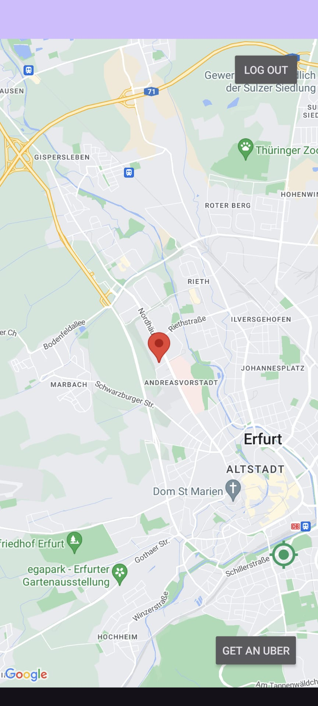
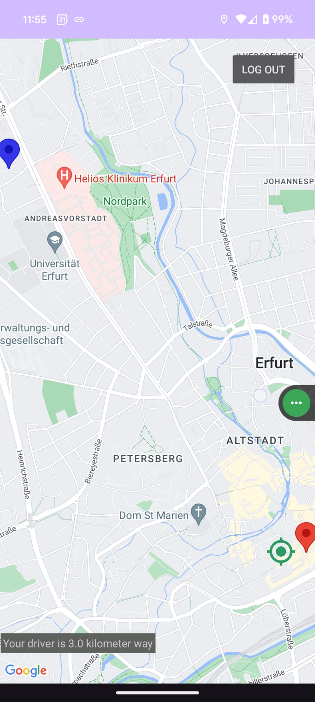
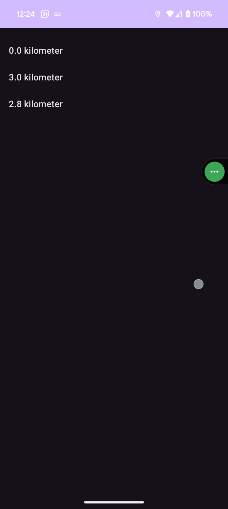
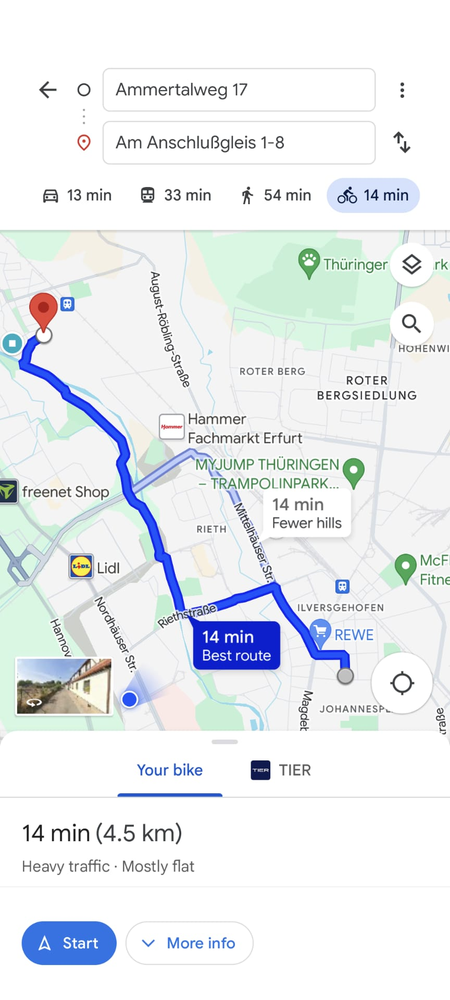
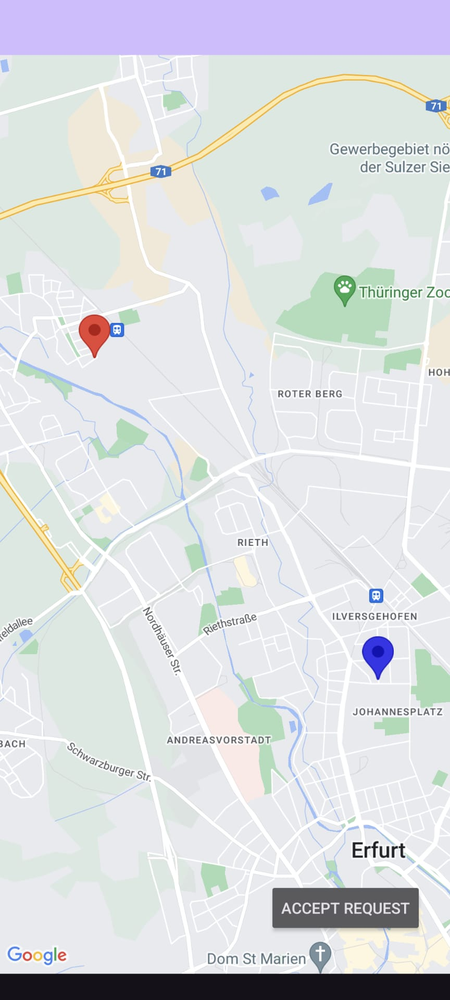
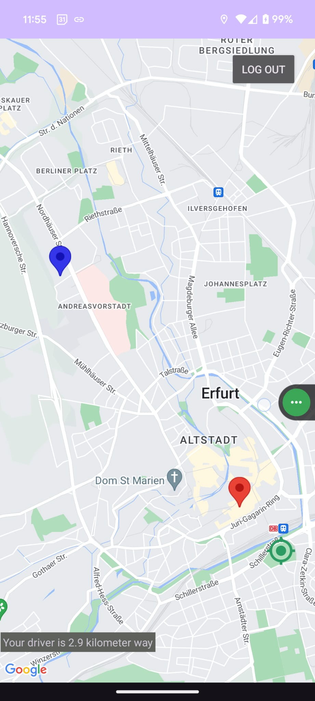

# uber-clone

A clone of one of the most popular apps in recent times.

So Uber is a pretty straightforward idea. A rider taps on the app when they want to take a car somewhere, and then a nearby driver is alerted of that rider and then goes and pick them up.


<br/>
<br/>

# What I have learned 👍 

* Server cloud storage skills with **`maps`** and **`GPS`**, which are perhaps the two most powerful aspects of mobile apps working together.
* **`AWS`**, creating a new **`EC2`** instance for our **`Parse Server`** code.
* How to use **`Google Map SDK`**
* How to setup **`google console cloud`**. restricting _**API**_.
* How to search for a **`Location`**, adding **`Marker`**in map, **`Navigation`**,
* **`Parse Query:`** inserting, deleting, updating and How to store GeoLocation.
* How to get **`User`** **`Location`** and share location with other.

***
# Features
- User authentication (Sign Up, Log In)
- Activity tracking
- Notifications upon new Rider request post
- Driver LOcation Tracking
- Cancle a request.
- one app for both Driver and Rider

***
# Screenshots 
<p align="center">
  
  
  
  
  
  
  
  
</p>

***
# Installation
1. Clone the repository
   ```
   git clone https://github.com/nazmos-sakib/uber-clone.git
   ```
2. Open the project in Android Studio
3. Build the project and run it on an emulator or physical device

***
# Requirements

### Software
- **Android Studio** 4.0 or higher
- **Android SDK** 26 or higher
- **Build Tools Version** 34
- **Gradle.kts Version** gradle-8.2 

### Libraries
- **Parse**: `implementation 'com.github.parse-community.Parse-SDK-Android:parse:4.2.0'`
- **Google Map**: `"com.google.android.gms:play-services-maps:18.2.0"`
- **multidex**: `"com.android.support:multidex:1.0.3"`

### Hardware
- **GPS**: Required for location tracking

### Permissions
- `android.permission.INTERNET`
- `android.permission.ACCESS_FINE_LOCATION`
- `android.permission.ACCESS_COARSE_LOCATION`
- `android.permission.ACCESS_NETWORK_STATE`

***
# License
This project is licensed under the MIT License - see the [LICENSE](LICENSE) file for details.
